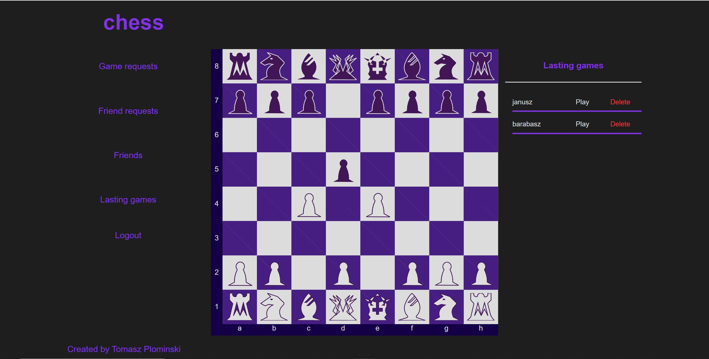

# PurpleChess

PurpleChess is a web app that lets its user to play chess online with their friends.

I had built it to test my NodeJS, mongoDB, Express and passport skills in practice.

The app is not prepared for use on screens with vertical orientation(app propably will not display correctly on your smartphone or tablet unless you will rotate it)

Deployed App can e found under this adress: [http://purple-chess.herokuapp.com](http://purple-chess.herokuapp.com)

## Technologies Used:

**Backend:**

-JavaScript

-Node.js

-MongoDB

-Express

-passport(Google oAuth)

**Frontend:**

-JavaScript (ES6+)

-HTML

-CSS

-Webpack,Babel

## Instruction:

**Registration/Logging in:**

You can login/register using google oAuth

**Adding Friends:**

To send a friend request click the _"Friend Request"_ button on the left, then type your friends nickname in the text input line and click the plus button.

You can accept or reject incomming request in the same panel.

**Inviting to the game:**

To invite somebody to play together click the _"Friends"_ button on the left, then find the person you want to play with and click the button _"Play"_ next to them.

**Accepting game requests:**

To view incomming game requests click the _"Game requests"_ button on the left, when you will accept game invitation new game will be created for you.

**Opening lasting game:**

You can find your lasting games clicking the _"Lasting games"_ button on the left.

The app still has one bug I have to fix
